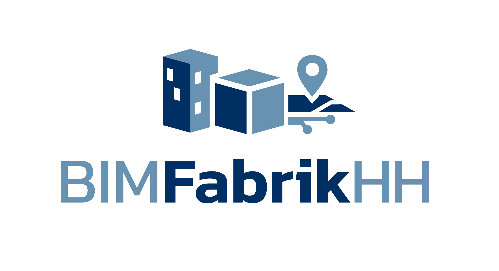

<p class="bimfabrik-hero">
  
</p>

# BIMFabrikHH documentation

Welcome. This site will bring together documentation for:

- **ifcfactory** — IFC geometry building blocks
- **BIMFabrikHH Core** — geodata → IFC applications
- **BIMFabrikHH API** — HTTP service for model generation

## Local preview

From the repository root (with Poetry):

```bash
poetry run zensical serve
```

Open [http://localhost:8000](http://localhost:8000).

## Build static site

```bash
poetry run zensical build
```

Output is written to the `site/` directory (see `zensical.toml`).
